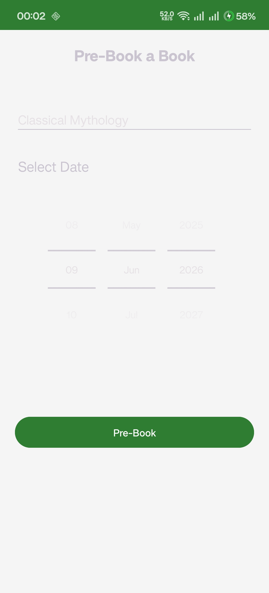
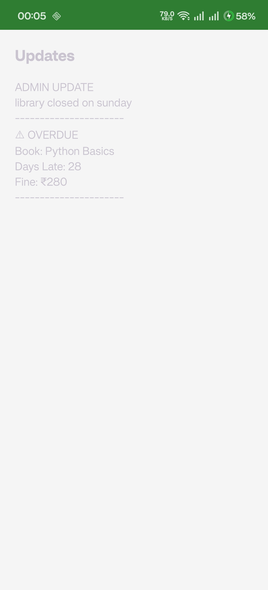

# Library Management System (MAD Project)

A native Android application developed using Java and XML, designed to handle digital library administration and member activities. The system features separate dashboard environments for Administrators and Users, driven by a localized SQLite architecture to streamline book discovery, pre-booking, issue management, and real-time fine calculation.

---

## Architecture Overview

The application follows a modular, monolithic architecture structured around standard Android Activities and an embedded database. By relying entirely on a local SQLite database, the system remains completely self-contained, requiring no external cloud dependencies or active internet connection to process transactions, calculate fines, or manage user data.

---

## Detailed Features

### Multi-Role Authentication System

The application implements an access-control system right at the gateway (`MainActivity.java`). Users register with a unique username and select their system role:

* **Admin Dashboard:** Tailored toward inventory control, logistical fulfillment, and revenue verification. Admins have access to search mechanisms that can edit book statuses, calculate fines, and issue global announcements.
* **User Dashboard:** Tailored toward an intuitive, clean reader experience. Users can search the catalog, view personal history records, request advance pre-bookings, and monitor notifications.

### Administrative Capabilities

* **Book Issue Engine:** Admins can query books through a real-time search interface. Selecting an available book launches `IssueActivity.java`, where a specific user can be assigned using native `DatePicker` components to map clear issue and target return timelines.
* **Return Processing:** The app checks the structural database records to match active loans. When a book is handed back, the status switches dynamically from `issued` to `returned`.
* **Real-Time Fine Management:** Integrated directly into `FineActivity.java`. It parses the timestamp of active borrowings, determines if the deadline has expired, and outputs live currency evaluations. Fines are cleared from the queue once the admin confirms physical payment collection.
* **Global Broadcasts:** Admins can compose system announcements in `SendUpdateActivity.java`. Submitting saves the text directly into a dedicated broadcast table, making it available to all application users instantly.

### User Experience (Members)

* **Smart Catalog Browsing:** Implemented in `UserSearchActivity.java`. Users type queries into a text filter that continuously searches both title and author columns simultaneously.
* **Personalized Circulation Log:** `RecordActivity.java` aggregates historical loan logs specific to the logged-in user. It displays past reading history, active items, assigned return targets, and fine flags.
* **Advance Pre-Booking:** Accessible via `PrebookActivity.java`. If a book is expected to be popular, users can reserve it before arriving at the physical library, provided the reservation falls within a specific chronological window.
* **Dynamic Notification Board:** Located in `UpdateActivity.java`. It combines global administrative notice streams with automated personal alerts. The system calculates upcoming deadlines and flags an alert if an active loan is due within 2 days or is already overdue.

---

## Database Architecture

The data engine runs on an optimized SQLite database (`Library.db`) managed through `Dbhelper.java`, which extends `SQLiteOpenHelper`. It controls schema generation, upgrades, and structured CRUD operations.

### Tables and Schema Rules

```sql
-- 1. Users Table: Tracks system access credentials and access scopes
CREATE TABLE users (
    id INTEGER PRIMARY KEY AUTOINCREMENT,
    username TEXT UNIQUE,
    password TEXT,
    role TEXT
);

-- 2. Books Table: Main repository for library inventory metadata
CREATE TABLE books (
    id INTEGER PRIMARY KEY AUTOINCREMENT,
    name TEXT,
    author TEXT,
    publisher TEXT
);

-- 3. Issued Table: Tracks transaction life cycles, limits, and penalties
CREATE TABLE issued (
    id INTEGER PRIMARY KEY AUTOINCREMENT,
    customer TEXT,
    book TEXT,
    issueDate TEXT,
    returnDate TEXT,
    status TEXT,         -- State flags: 'issued' or 'returned'
    finePaid TEXT        -- Balance flags: 'no' or 'yes'
);

-- 4. Updates Table: Central logging storage for admin notifications
CREATE TABLE updates (
    id INTEGER PRIMARY KEY AUTOINCREMENT,
    message TEXT
);

```

---

## Business Logic Mechanisms

### Fine Calculation Algorithm

Fines are computed dynamically inside `FineActivity.java` using chronological millisecond intervals. The app extracts the target return string, converts it into an absolute Unix timestamp, and compares it against the active system time:

$$\text{Days Late} = \frac{\text{Current Time (ms)} - \text{Return Date Target (ms)}}{1000 \times 60 \times 60 \times 24}$$

$$\text{Total Fine Due} = \text{Days Late} \times 10$$

> **Note on Business Logic:** If the evaluation yields a value less than or equal to 0, the fine stays locked at 0. If greater than 0, a flat rate of 10 units per day is applied.

### Pre-Booking Buffer Check

To keep book circulation fluid and prevent asset hoarding, the pre-booking system enforces a strict time validation window within `PrebookActivity.java`:

* **Success Parameter:** $0 \le \text{Requested Date} - \text{Current Date} \le 2 \text{ days}$
* If a user tries to pre-book an item 3 or more days into the future, the transaction fails structural validation, triggering a context-aware warning message.

---

## System Project Structure

```text
app/src/main/java/com/example/madproject/
├── MainActivity.java           # Entry point; controls login validation and registration paths
├── AdminActivity.java          # Primary structural hub routing to admin utilities
├── UserActivity.java           # Primary structural hub routing to member dashboards
├── Dbhelper.java               # SQLite open helper wrapper executing raw and compiled queries
├── SearchActivity.java         # Master inventory lookup window for admins to handle returns
├── UserSearchActivity.java     # Text-filtered book search UI tailored for library members
├── IssueActivity.java          # Processes checkouts with explicit date validation calendars
├── PrebookActivity.java        # Manages advance short-window reservation workflows
├── FineActivity.java           # Time-delta calculation interface handling fine collections
├── RecordActivity.java         # Aggregates chronological transaction logs per member
├── SendUpdateActivity.java     # Composition window for admin system announcements
└── UpdateActivity.java         # Notification dashboard reading broadcast rows and deadlines

```

---

## Component Layout & UI Architecture

The user interface is declared declaratively across companion XML layout resources located in `res/layout/`.

* **Form Layouts:** Login and registration forms use nested vertical `LinearLayout` and `TextInputLayout` components to provide clean input styling.
* **List Renderers:** Historical logs, search returns, and notices are bound dynamically using high-performance adapter sets that extract matching collection fields straight from database cursors.

---

## Getting Started

### Prerequisites

* Android Studio Jellyfish / Ladybug (or newer)
* Minimum Android SDK Support: API Level 26 (Android 8.0 Oreo)
* Java Development Kit (JDK): Version 17 or higher

### Installation Steps

1. Clone this repository onto your workstation directory:
git clone https://github.com/your-username/your-repo-name.git

2. Launch Android Studio, select **Open**, and navigate to the root directory of the cloned files.
3. Wait for the IDE to finish processing the structural `build.gradle` project synchronization.
4. Set up an Android Virtual Device (AVD) running at least API level 26 or connect a physical device via USB debugging.
5. Click the green **Run** button or press `Shift + F10` to compile and deploy the APK.

---
## Screenshots

| Login Page | User Dashboard | User Search | Prebook Screen | Admin Updates |
| :---: | :---: | :---: | :---: | :---: |
|  |  |  |  |  |

## License

This project is open-source and licensed under the MIT License.

---

*Developed by Romil*

```
